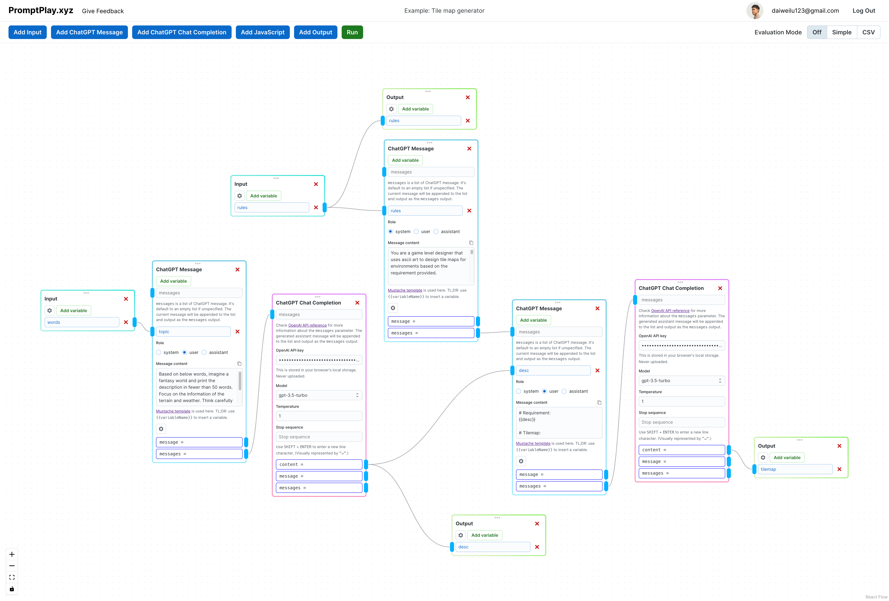

# PromptPlay

An experiment on visual prompt chaining.



## How run locally

### Set up the environment

Make sure you already have Python 3.11, Node.js LTS, and Docker installed.

1.  Create Python virtual environment:
    ```sh
    python3 -m venv venv
    ```
2.  Activate the virtual environment and install Python dependencies:
    ```sh
    source venv/bin/activate
    pip install -r requirements.txt
    ```
3.  Install Node.js dependencies in the root directory:
    ```sh
    npm i
    ```
4.  Install Node.js dependencies in the `front` directory:
    ```sh
    cd front
    npm i
    ```
5.  Create local environment file.

    Duplicate `.env` and rename it to `.env.local`:

    ```sh
    cp .env.local .env
    ```

    Add these content to the file

    ```sh
    POSTGRES_HOST=localhost
    POSTGRES_PORT=5432
    POSTGRES_USER=postgres
    POSTGRES_PASSWORD=example
    POSTGRES_DATABASE_NAME=promptplay-dev
    AUTH0_DOMAIN=
    AUTH0_CLIENT_ID=
    AUTH0_CLIENT_SECRET=
    AUTH_CALLBACK_URL=http://localhost:8000/auth
    AUTH_FINISH_REDIRECT_URL=http://localhost:3000
    CORS_ALLOW_ORIGIN=http://localhost:3000
    SESSION_SECRET_KEY=
    ```

    - You will have to register an Auth0 account and create an application to get the `AUTH0_DOMAIN`, `AUTH0_CLIENT_ID`, and `AUTH0_CLIENT_SECRET` values.
    - `SESSION_SECRET_KEY` can be anything you want.

### Make sure local database has up to date schema

1. Make sure virtual environment is activated:
   ```sh
   source venv/bin/activate
   ```
2. Start Docker containers:
   ```sh
   docker-compose up
   ```
3. Create the database for the first time:
   ```sh
   (set -a && source .env.local && set +a && PYTHONPATH=. python scripts/create_database.py)
   ```

### Run the app

1. Make sure virtual environment is activated:
   ```sh
   source venv/bin/activate
   ```
2. Run the app:

   ```sh
   ./dev.sh
   ```

   This script will do four things:

   1. Run `docker-compose up`.
   2. Start the backend server with `uvicorn`.
   3. Start Vite dev server for the frontend.
   4. Start GraphQL codegen watcher for the frontend.

3. Open [localhost:3000](http://localhost:3000) in your browser.
